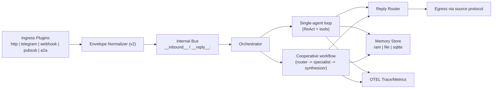
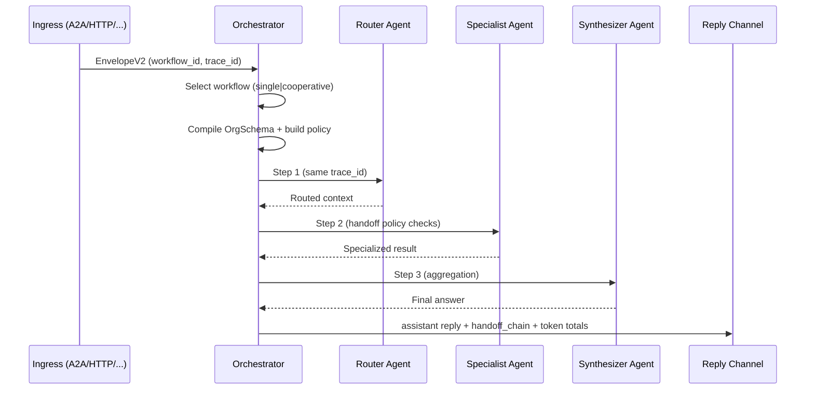

# Krill 🦀

> Ultra-light · Security-first · Multi-protocol · Multi-agent orchestrator  
> ~2700 lines of Go. Zero frameworks. One binary. Plug-n-play protocols.

---

## Quickstart

```bash
# 1. Clone and enter
git clone <your-repo> krill && cd krill

# 2. Install dependencies (only uuid + yaml)
make tidy

# 3. Copy and edit config
cp krill.yaml.example krill.yaml
# → set OPENAI_API_KEY or edit base_url for local LLM
# → alternatively create .env (same folder as krill.yaml), e.g. GROQ_API_KEY=...
# → choose log format with core.log_format: json|text

# 4. Build and run
make run

# 5. Send a message
curl -X POST http://localhost:8080/v1/chat \
  -H "Content-Type: application/json" \
  -d '{"client_id":"test","message":"What is 2+2?"}'
```

---

## Quick Cooperative + A2A Demo

Enable `a2a` and a cooperative workflow in `krill.yaml`:

```yaml
protocols:
  - name: a2a
    enabled: true
    config:
      addr: ":8091"
      path: "/a2a/v1/envelope"

workflows:
  - id: wf-coop
    orchestration_mode: cooperative
    org_schema: default-coop-v1
```

Send a strict `EnvelopeV2` to A2A ingress:

```bash
curl -X POST http://localhost:8091/a2a/v1/envelope \
  -H "Content-Type: application/json" \
  -d '{
    "schema_version":"v2",
    "id":"a2a-1",
    "client_id":"demo-client",
    "thread_id":"demo-thread",
    "tenant":"default",
    "workflow_id":"wf-coop",
    "source_protocol":"a2a",
    "role":"user",
    "text":"Route this request and synthesize a final answer.",
    "meta":{"origin_agent":"external-router","target_agent":"router","handoff_reason":"initial_handoff"},
    "created_at":"2026-03-05T10:00:00Z"
  }'
```

---

## Architecture

Krill is a protocol-agnostic agent runtime with two orchestration paths:
- **single-agent** (legacy-compatible ReAct loop per client)
- **cooperative multi-agent** (router/specialist/synthesizer driven by declarative `OrgSchema`)

### 1) End-to-end runtime flow



### 2) Cooperative orchestration (M3)



### 3) What is supported today

- **Ingress protocols**
  - `http` (`/v1/chat`)
  - `telegram` (polling bot)
  - `webhook` (generic JSON + signature modes)
  - `pubsub` (adapter model: `nats`, `redis_streams`, `solace`)
  - `a2a` (strict v2 envelope validation + handoff metadata support)
- **Message schema**
  - canonical `EnvelopeV2`: `schema_version`, `tenant`, `workflow_id`, `hop`, `capabilities`, metadata, timestamps
  - strict validation mode at ingress
- **Orchestration**
  - `single`: per-client loop, protocol-aware routing, max client semaphore
  - `cooperative`: `OrgSchema`-compiled pipeline with:
    - roles: `router`, `specialist`, `synthesizer`
    - handoff policy: `max_hops`, `allowed_pairs`, `step_timeout_ms`, `token_budget`
    - persisted handoff chain in workflow state metadata
- **LLM runtime**
  - OpenAI-compatible chat completions
  - backend pool + fallback to default backend
  - retry-without-tools on malformed tool-call responses (`tool_use_failed`)
- **Skills**
  - built-in skills + `exec` runtime + `wasm` placeholder + `noop`
  - lazy skill activation with `skill.View`
- **Memory/session**
  - thread-aware history store: `ram` / `file` / `sqlite`
- **Observability**
  - OTEL profiles (`off|minimal|standard|debug`)
  - trace continuity across ingress/orchestrator/agent/tool calls
  - metrics for loops/queues/handoffs/memory/tool/runtime
- **Runtime/deploy**
  - local: Docker/Compose + sandbox profile + one-command scripts
  - cluster: Helm chart + minikube scripts + k8s/openshift docs

### 4) What it is capable of (extension points)

- Add new protocols via plugin registry (`core.Global().RegisterProtocol`)
- Replace bus implementation for multi-node horizontal scale
- Add policy dimensions (quotas, RBAC, trust score) without changing protocol contracts
- Evolve cooperative compiler from linear pipeline to richer graph planners
- Add external pubsub adapters and durable workflow state stores

### 5) Security model (practical)

- optional HTTP Bearer auth
- webhook signature verification (HMAC mode)
- protocol-specific secrets/tokens kept in config/env
- exec runtime uses isolated ephemeral workspace and restricted env
- bounded request body / bounded response payload paths in protocol plugins

---

## Project Structure

```
krill/
├── cmd/krill/main.go          ← entry point (40 lines)
├── config/config.go              ← typed YAML schema
├── internal/
│   ├── bus/bus.go                ← pub/sub backbone (interface + local impl)
│   ├── core/
│   │   ├── engine.go             ← wires everything together
│   │   └── registry.go           ← plugin factory registry (no circular imports)
│   ├── orchestrator/orchestrator.go  ← mode selector + single-agent manager
│   ├── orchestrator/cooperative.go   ← cooperative executor + OrgSchema compiler
│   ├── orchestrator/policy.go        ← handoff policy evaluator
│   ├── agent/loop.go             ← ReAct loop with lazy skill loading
│   ├── skill/registry.go         ← marketplace + View (progressive loading)
│   ├── memory/memory.go          ← per-thread conversation history
│   ├── llm/llm.go                ← OpenAI-compatible pool
│   └── sandbox/sandbox.go        ← exec (ephemeral tmpfs) + wasm stub + noop
└── plugins/
    ├── protocol/
    │   ├── http/http.go          ← REST + SSE
    │   ├── telegram/telegram.go  ← long-poll bot
    │   ├── webhook/webhook.go    ← generic (Slack/Discord/WhatsApp)
    │   └── a2a/a2a.go            ← strict A2A ingress
    └── skill/builtins/builtins.go ← http_fetch, json_format, json_extract
```

---

## Adding a Protocol Plugin

```go
// plugins/protocol/myproto/myproto.go
package myproto

import "github.com/krill/krill/internal/core"

func init() {
    core.Global().RegisterProtocol("myproto", func(cfg map[string]interface{}) (core.Protocol, error) {
        return &Plugin{addr: cfg["addr"].(string)}, nil
    })
}

type Plugin struct{ addr string }
func (p *Plugin) Name() string { return "myproto" }
func (p *Plugin) Start(ctx context.Context, b bus.Bus, log *slog.Logger) error { ... }
func (p *Plugin) Stop(ctx context.Context) error { ... }
```

Then add `_ "github.com/krill/krill/plugins/protocol/myproto"` to `cmd/krill/main.go`
or in a dedicated file under `cmd/krill/` (same package, blank import).

---

## Adding a Skill

**Option A — Go builtin** (in `plugins/skill/builtins/builtins.go`):
```go
sr.RegisterBuiltin("my_skill", "Does X", &myExecutor{}, jsonSchemaRaw)
```

**Option B — Any executable** (stdin JSON → stdout result):
```yaml
skills:
  - name: my_script
    description: "Does Y"
    runtime: exec
    path: ./skills/my_script.py
    input_schema: '{"type":"object","required":["input"],"properties":{"input":{"type":"string"}}}'
    tags: [nlp]
```

**Option C — WASM** (build with `-tags wasm` + add `wazero` dep):
```yaml
skills:
  - name: my_wasm
    runtime: wasm
    path: ./skills/my_skill.wasm
```

---

## Lazy Loading: Eager vs Lazy Skills

```yaml
agents:
  - name: default
    eager_skills:           # always in LLM context
      - http_fetch
      - json_format
      - code_exec
    # All other registered skills are lazy:
    # they activate automatically on first use,
    # or manually via view.ActivateByTag("research")
```

---

## Running Tests

```bash
make test
# or with verbose output:
go test ./... -race -v -count=1
```

### Quick CLI checks (M0)

```bash
# 1) Full test gates
go test ./... -race -count=1
go test ./... -covermode=atomic -coverprofile=coverage.out

# 2) Mapper/normalizer micro-benchmark
go test ./internal/schema -bench BenchmarkNormalizeV2 -benchmem -run ^$

# 3) Local deploy script smoke tests (mock docker)
go test ./deploy/scripts/dev -count=1

# 4) Optional live stack smoke (requires docker)
./deploy/scripts/dev/up.sh
curl -N -X POST http://localhost:8080/v1/chat \
  -H "Content-Type: application/json" \
  -d '{"client_id":"smoke","thread_id":"smoke","message":"ping"}'
./deploy/scripts/dev/down.sh
```

---

## Coding Sandbox Skill (`code_exec`)

`code_exec` is a built-in skill for lightweight "opencode"-style execution:
- creates an ephemeral workspace per invocation
- writes one or more files
- executes `python3`, `node`, or `bash` entrypoint
- returns structured JSON (`ok`, `exit_code`, `stdout`, `stderr`, `duration_ms`)

Example call through the agent:

```bash
curl -N -X POST http://localhost:8080/v1/chat \
  -H "Content-Type: application/json" \
  -d '{"client_id":"test","message":"Use code_exec to run python code that prints the first 10 fibonacci numbers, then return only the final output."}'
```

Observability fields now included in logs/SSE payload:
- `trace_id`, `request_id`
- span logs (`span start` / `span end`) for HTTP ingress, agent turn, tool call
- token usage (`tokens_prompt`, `tokens_completion`, `tokens_total`) aggregated per request
- optional generated code logging: `core.log_generated_code: true`

---

## Multi-node Scaling

The `bus.Bus` interface is the only coupling point. Replace `bus.NewLocal()` in `engine.go` with a NATS or Redis Streams implementation — zero other changes needed.

```go
// Future: one line change in internal/core/engine.go
b := natsbus.New(cfg.NATS.URL, cfg.Core.BusBuffer)
```

---

## Security Model

| Layer | Mechanism |
|-------|-----------|
| HTTP auth | Optional Bearer token |
| Webhook auth | HMAC-SHA256 signature verification |
| Telegram | Bot token |
| exec skills | Ephemeral tmpdir + minimal env (HOME/TMPDIR/PATH only) |
| WASM skills | CPU fuel limit, no syscalls (wazero WASI restrictions) |
| HTTP input | 1MB body limit, 512KB response limit |
| Container | Distroless non-root, no shell |
